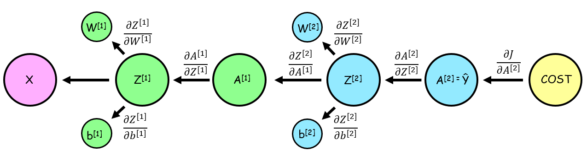
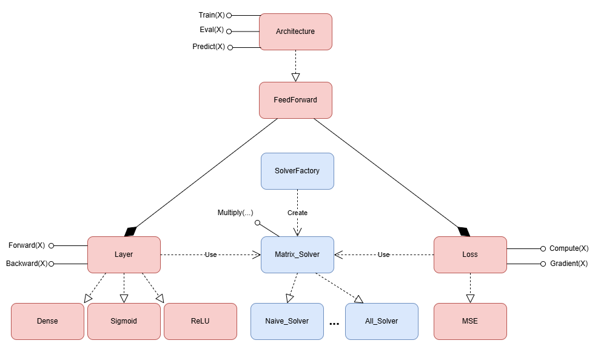
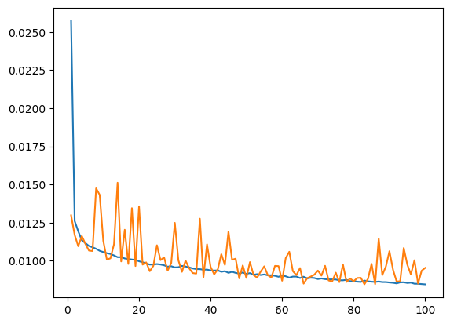
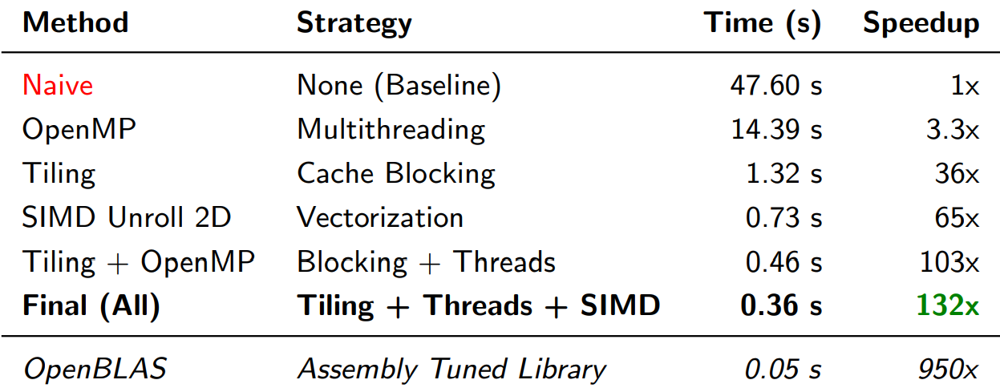

# NeuralNets

## Project Goal

The **main objective** of this project is to implement and benchmark highly **efficient and parallel Matrix Multiplication** routines from scratch using modern C++.\
The **Feed-Forward Neural Network (FFNN)** serves as the critical application platform where the performance and scalability of these custom solvers are rigorously tested during the training and inference processes.

## How to Run the Code

### Prerequisites

* C++ compiler
* OpenMP
* pthread
* AVX/AVX2/FMA
* Optional: python (Pandas) for preprocessing

### Build and Run Instructions

#### Optional (to perform our same testing procedure)
1. Download the dataset, move it to the *dataset* folder and unzip it \
https://www.kaggle.com/datasets/camnugent/california-housing-prices

2. Run the preprocessor in the *dataset* folder to obtain processed data 
```bash
python dataset/Preprocessor.py
```

#### To run the program
1. Compile
```bash
g++ src/main.cpp -mavx -mfma -mavx2 -fopenmp -lpthread -o main
```

2. Run
```bash
./main
```

## Mathematical formulation

Training Feed-Forward Neural Networks typically involves [backpropagation](http://en.wikipedia.org/wiki/Backpropagation), which applies the [chain rule](https://en.wikipedia.org/wiki/Chain_rule) to compute gradients layer-by-layer, followed by [gradient descent](https://en.wikipedia.org/wiki/Gradient_descent) to update the network parameters.



## Architecture

The software architecture translates the mathematical formulation into a modular design. It separates the **neural network** components from the **matrix solver** responsible for matrix products. It also ensure extensibility through abstract base classes for all major components: Architecture, Layer, Loss, and Matrix_Solver.



## File structure

Mirroring the **architecture**, the file structure is also designed to separate the **neural network** from the **matrix solver** implementations.

**Note: Each folder contains its own `README.md` with a detailed explanation of its contents.**

```
NeuralNets
|-- dataset
|  |-- Preprocess.py
|  \-- dataset .csv files
|-- include
|  |-- NeuralNetwork
|  |  |-- Architecture
|  |  |  |-- Architecture.hpp
|  |  |  \-- FeedForward.hpp
|  |  |-- DataLoader
|  |  |  \-- DataLoader.hpp
|  |  |-- Layer
|  |  |  |-- Layer.hpp
|  |  |  |-- Dense.hpp
|  |  |  |-- ReLu.hpp
|  |  |  \-- Sigmoid.hpp
|  |  |-- Loss
|  |  |  |-- Loss.hpp
|  |  |  |-- MSE.hpp
|  |  \-- Matrix.hpp
|  |-- repo_mtx
|  |  \-- Report folders
|  |-- solvers
|  |  \-- Solver .hpp implementations
|  |-- utilities
|  |-- factory_m.hpp
|  \--matrix_solver.hpp
\-- src
   \-- main.cpp
```

## Neural Network Training Results
Training the Feed-Forward Neural Network resulted in a clear sign of convergence. The blue line represents training loss, while the orange line represents validation loss. As shown in the graph, the Training Loss **consistently decreased over epochs**, while the Validation Loss closely followed it, even if some spikes appear in the graph. This outcome confirms the correct implementation of the entire neural network architecture, from data loading to the custom matrix multiplication engine.



## Results

The performance evaluation focused on measuring the speedup achieved by our custom optimized solvers against the base-line naive method on a fixed benchmark problem.

While recognizing that ultimate performance does not yet match highly tuned, platform-specific libraries (like OpenBLAS), our custom C++ implementation achieved a significant performance gain.


